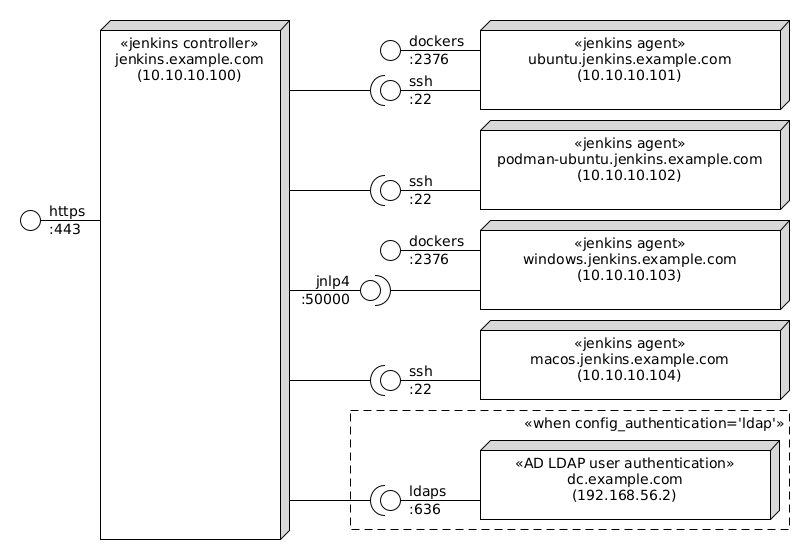

This is a [Vagrant](https://www.vagrantup.com/) Environment for a Continuous Integration server using the [Jenkins](https://jenkins.io) daemon.

This configures Jenkins through [CLI/JNLP](https://wiki.jenkins-ci.org/display/JENKINS/Jenkins+CLI) and [Groovy](http://www.groovy-lang.org/) scripts to:

* Enable the simple `Logged-in users can do anything` Authorization security policy.
* Add a SSH public key to `vagrant` user account and use it to access the CLI.
* Optionally use LDAP user authentication.
* Add and list users.
* Install and configure plugins.
* Setup GitLab integration (assumes [rgl/gitlab-vagrant](https://github.com/rgl/gitlab-vagrant) is already deployed)
* Setup nginx as a Jenkins HTTPS proxy and static file server.
* Create Freestyle project job.
* Create Pipeline job.
* Create Multibranch Pipeline job.
* Add a Ubuntu Linux slave node.
* Add a Windows slave node.
  * With enabled long path support on the OS and chocolatey.
  * With [MSYS2](https://github.com/msys2/msys2/wiki/MSYS2-introduction) to be able to use the `Execute shell` build step.
    * See the [example-execute-shell-windows](https://jenkins.example.com/job/example-execute-shell-windows) job.
  * With Unity Editor.
    * You still need to [activate](https://docs.unity3d.com/Manual/LicensesAndActivation.html) it by
running Unity Hub.
* Add a macOS slave node.

**NB** If you are new to Groovy, be sure to check the [Groovy Learn X in Y minutes page](https://learnxinyminutes.com/docs/groovy/).

These are the machines and how they are connected with each other:




# Usage

Build and install the [Ubuntu 18.04 Base Box](https://github.com/rgl/ubuntu-vagrant).

Build and install the [Windows 2019 Base Box](https://github.com/rgl/windows-2016-vagrant).

Build and install the [macOS Base Box](https://github.com/rgl/macos-vagrant).

Add the following entry to your `/etc/hosts` file:

```
10.10.10.100 jenkins.example.com
```

If you want to use LDAP for user authentication, you have to:

1. have [rgl/windows-domain-controller-vagrant](https://github.com/rgl/windows-domain-controller-vagrant) up and running at `../windows-domain-controller-vagrant`.
1. uncomment the `config_authentication='ldap'` line inside [provision.sh](provision.sh). 

Run `vagrant up jenkins` to launch the master. See its output to known how to login at the
[local Jenkins home page](https://jenkins.example.com) as `admin` (you can also login with
one of the example accounts, e.g. `alice.doe` and password `password`).

**NB** nginx is setup with a self-signed certificate that you have to trust before being able to access the local Jenkins home page.

Run `vagrant up ubuntu` to launch the Ubuntu slave.

Run `vagrant up windows` to launch the Windows slave.

Run `vagrant up macos` to launch the macOS slave. **NB** you first need to download [Xcode_8.1.xip](https://developer.apple.com/download/more/).
After provisioning you can delete it, as `Xcode_8.1.cpio.xz` will take its place as a more efficient way to install Xcode.

Email notifications are sent to a local [MailHog](https://github.com/mailhog/MailHog) SMTP server running at localhost:1025 and you can browse them at [http://jenkins.example.com:8025](http://jenkins.example.com:8025).


# Groovy Snippets

## Show Object Properties

```groovy
def getObjectProperties(obj) {
    def filtered = ['class', 'active']

    properties = obj.metaClass.properties
        .findAll {it.name != 'class' && it.name != 'metaClass'}
        .inject([:]) {acc, e -> acc[e.name] = e.getProperty(obj); acc}

    properties
        .sort {it.key}
        .collect {it}
        .findAll {!filtered.contains(it.key)}
        .join('\n')
}

project = Jenkins.instance.getItem('MailBounceDetector-multibranch-pipeline')
getObjectProperties(project)
```

## Create Api Token

```groovy
// create an user api token.
// see http://javadoc.jenkins-ci.org/hudson/model/User.html
// see http://javadoc.jenkins-ci.org/jenkins/security/ApiTokenProperty.html
// see https://jenkins.io/doc/book/managing/cli/
import hudson.model.User
import jenkins.security.ApiTokenProperty

u = User.getById('alice.doe', false)
p = u.getProperty(ApiTokenProperty)
t = p.tokenStore.generateNewToken('token-name')
u.save()
println t.plainValue
```

# Reference

* [Jenkins Handbook](https://jenkins.io/doc/book/)
